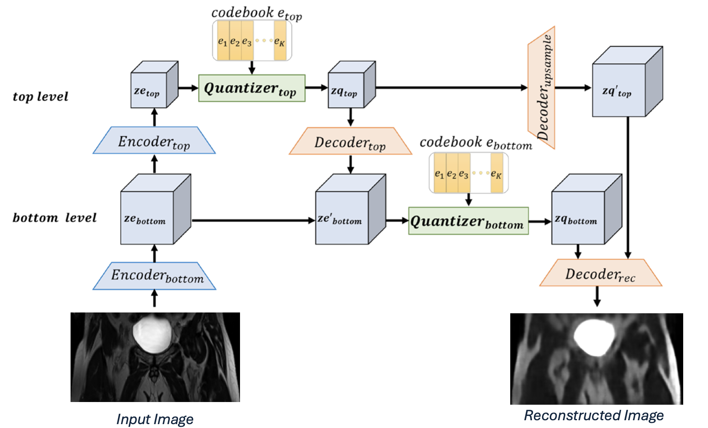
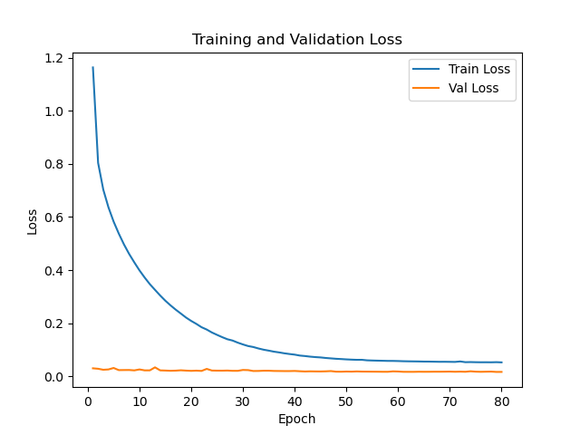
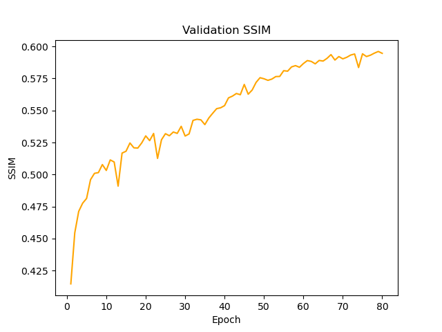
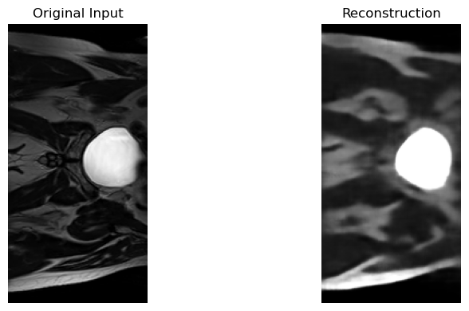

# Jaimee Taylor
Student: 46989381 | Email: s4698938@uq.edu.au 

# HipMRI — Prostate Cancer Generative Model (VQVAE2)
**Generative modelling of HipMRI prostate-cancer 2D slices using VQ-VAE**

**Goal:** produce visually clear reconstructions and generations with Structural Similarity (SSIM) > 0.6.

## Motivation
Medical imaging datasets, such as prostate MRI scans, are often limited in size and diversity due to patient privacy concerns, acquisition costs, and labeling complexity. This scarcity makes it difficult to train robust deep learning models for diagnosis or segmentation. Generative models like VQ-VAE-2 offer a solution by learning compact and meaningful latent representations of MRI data, enabling the generation of realistic synthetic images and high-quality reconstructions. Such models can enhance dataset diversity, support data augmentation, and improve the understanding of structural patterns associated with prostate cancer.

## Data Processing

All data preparation methods are implemented in the **`dataset.py`** file.

The dataset used in this project comes from the **HipMRI Study** for prostate cancer radiotherapy and consists of prostate 2D MRI slice data stored under the folder **`keras_slices_data/`**.

The HipMRI dataset contains grayscale 2D MRI images of the pelvis, primarily sized at **256×128 pixels**.  
Any images not matching this resolution in the original dataset were excluded during preprocessing.

**Dataset Split:**
- **Training Set:** 11,460 images  
- **Validation Set:** 660 images  
- **Test Set:** 540 images

## Data Pipeling

The data pipeline used Nibabel to load 2D MRI slices from NIfTI files, followed by NumPy-based preprocessing to normalise intensity values and filter out incorrectly sized images. Each slice was standardised using z-score normalisation and reshaped into a consistent 256×128 format. The processed images were then converted into PyTorch tensors, with a channel dimension added to fit convolutional input requirements. Finally, PyTorch DataLoaders were used to batch, shuffle, and efficiently feed data into the model for training, validation, and testing.

## Algorithm Description
A VQ-VAE is a variational autoencoder–style model that uses a discrete codebook to represent the latent space [2]. This allows it to achieve GAN-like realism while maintaining the stable, monotonic convergence of a VAE, avoiding the instability of adversarial training. VQ-VAE-2 extends this approach with a hierarchical latent structure to capture both global and fine-grained image features [1].

The VQ-VAE-2 model consists of a hierarchical encoder–decoder structure with two levels of latent representations. The **bottom encoder** extracts fine-grained features, while the **top encoder**, applied after downsampling, captures global features. Both latents are discretized using **vector quantizers**: the top quantizer processes the top-level latent, and the bottom quantizer processes a combination of the bottom-level latent and the upsampled top-level latent. The **decoder** then reconstructs the image from the quantized latent using transposed convolutions, residual blocks, instance normalization, and dropout. Residual connections and instance normalization throughout the network help maintain stable training and preserve high-quality feature representations.


*Figure 1: Overview of the VQ-VAE-2 hierarchical architecture, showing the bottom and top encoders, vector quantizers, and decoder [1].*


## Model Architecture

The VQ-VAE-2 model consists of three main components:

1. **Encoder:**  
   The encoder maps the input MRI slices into a lower-dimensional latent representation. It progressively downsamples the input using convolutional layers while preserving important structural information.

2. **Vector Quantization (VQ) Block:**  
   The latent representations from the encoder are discretized using a **codebook of embeddings**. This quantization step forces the model to learn a discrete set of latent features, which improves generative quality and helps with compression.

3. **Decoder:**  
   The decoder reconstructs the MRI slices from the quantized latent representations, using transposed convolutions to upsample back to the original resolution.

### Residual Blocks
Residual blocks are used throughout the encoder and decoder to **improve gradient flow and stabilise training**. They allow the model to learn identity mappings more easily, which helps in training deeper networks without degradation and improves reconstruction quality.


## Training

The VQ-VAE-2 model is trained for 80 epochs using the Adam optimizer, with a combined reconstruction (MSE) and vector quantization loss. During training, validation loss and SSIM are monitored each epoch to track reconstruction quality, and the final trained model along with loss and SSIM plots are saved in the train_dir folder.


## Dependencies and Setup

This project requires **Python 3.8+** and several libraries for deep learning, data processing, and visualization. To ensure reproducibility, it is recommended to use a **Conda environment**.

### Copying the Repository

If you want to **make changes** to the code, you should **fork** the repository first and then **clone your fork**.  
If you only want to **use the model**, you can simply **clone the repository** directly without forking.

### Setting Up

We’ll begin by creating a Conda environment. This can be done either **locally** or on **Rangpur**, depending on which GPU you plan to use.  
> **Note:** Accessing Rangpur requires a UQ VPN connection. You can use *Cisco Secure Client* to connect.

**Conda Environment Setup:**
```bash
# Create and activate the environment
conda create -n hipmri python=3.9
conda activate hipmri

# Install PyTorch with GPU support
conda install pytorch==2.2.0 torchvision torchaudio pytorch-cuda=12.1 -c pytorch -c nvidia

# Install additional dependencies
pip install matplotlib==3.8.0
pip install numpy==1.26.0
pip install nibabel==5.0.1
pip install torchmetrics==0.11.4
```

We will then create a SLURM file.
*train.sh:*
```bash
#!/bin/bash
#SBATCH --nodes=1
#SBATCH --ntasks-per-node=1
#SBATCH --cpus-per-task=1
#SBATCH --gres=gpu:1
#SBATCH --partition=a100
#SBATCH --job-name=vq_vae
#SBATCH -o train.out 
#SBATCH --time=10:00:00
conda activate hipmri # Change this to your environrmrnt name.
python train.py
```
### Running Jobs

Using this file we can then submit a job to the desired gpu.
*Submitting a Job:*
```bash
sbatch train.sh
```

Once you see the train.out file in your directory, the job has completed.
Alternatively, you can check progress with:
```bash
squeue -u your_student_username
```

> **Note:** The predict.py script is run in a similar way — simply replace the .py and .out filenames as desired.

### Moving Files

To transfer files between your local machine and Rangpur, you can use **FileZilla** or the command line tool **scp**.

I used *FileZilla* for convenience — it allows easy drag-and-drop transfers and saves your connection details, so you don’t need to log in each time.  

You can also use *scp*, but note that it requires authentication every time you transfer files.

> **Recommendation:** Use *FileZilla* for a smoother workflow when frequently moving files to and from Rangpur.


## Results
Following the steps above or running the file locally, you should obtain similar results after training the model. 

Your *train.out* file should look like this: 
```bash
All tensors loaded successfully!
Train tensor shape: torch.Size([11460, 1, 256, 128])
Validation tensor shape: torch.Size([660, 1, 256, 128])
Test tensor shape: torch.Size([540, 1, 256, 128])
Epoch 1/80 | Train Loss: 1.1632 | Val Loss: 0.0301 | Val SSIM: 0.415
Epoch 2/80 | Train Loss: 0.8039 | Val Loss: 0.0284 | Val SSIM: 0.454
Epoch 3/80 | Train Loss: 0.7031 | Val Loss: 0.0246 | Val SSIM: 0.471
...
Epoch 77/80 | Train Loss: 0.0529 | Val Loss: 0.0174 | Val SSIM: 0.593
Epoch 78/80 | Train Loss: 0.0527 | Val Loss: 0.0177 | Val SSIM: 0.595
Epoch 79/80 | Train Loss: 0.0532 | Val Loss: 0.0165 | Val SSIM: 0.596
Epoch 80/80 | Train Loss: 0.0525 | Val Loss: 0.0165 | Val SSIM: 0.595
Test SSIM: 0.624
```

As shown above, the model achieved a **Structural Similarity Index (SSIM) greater than 0.6**.  

After training, a new folder named **`train_dir`** will be created. This directory contains:  
- The trained model file: **`vqvae_model.pth`**  
- A **`plots/`** folder with visualizations generated during training (e.g., loss and SSIM curves).  

### Training Results

  
*Figure 2: Training Loss vs Epoch*

  
*Figure 3: Validation SSIM vs Epoch*

Now that the model has been trained, we can demonstrate an example using **`predict.py`**.  

Your *predict.out* file should look like this: 
```bash
Loading model...
Model loaded from train_dir/vqvae_model.pth
Loading data...
All tensors loaded successfully!
Train tensor shape: torch.Size([11460, 1, 256, 128])
Validation tensor shape: torch.Size([660, 1, 256, 128])
Test tensor shape: torch.Size([540, 1, 256, 128])
Test data loaded successfully.
Saved reconstruction figure to predict_dir/reconstruction.png
Prediction complete.
```

After running the prediction script, a new folder named **`predict_dir`** will be created. This directory contains:  
- An example reconstructed slice generated by the model: **`reconstruction.png`**

### Prediction Example

  
*Figure 4: Original vs Reconstructed*


## References
1. Nakada, K., & Kimata, H. (2023). A Study on Voxel Shape Generation and Reconstruction with VQ-VAE-2. A Study on Voxel Shape Generation and Reconstruction with VQ-VAE-2, 9–15. https://doi.org/10.1145/3606283.3606285

2. Oord, A. van den, Vinyals, O., & Kavukcuoglu, K. (2018). Neural Discrete Representation Learning. ArXiv:1711.00937 [Cs]. https://arxiv.org/abs/1711.00937